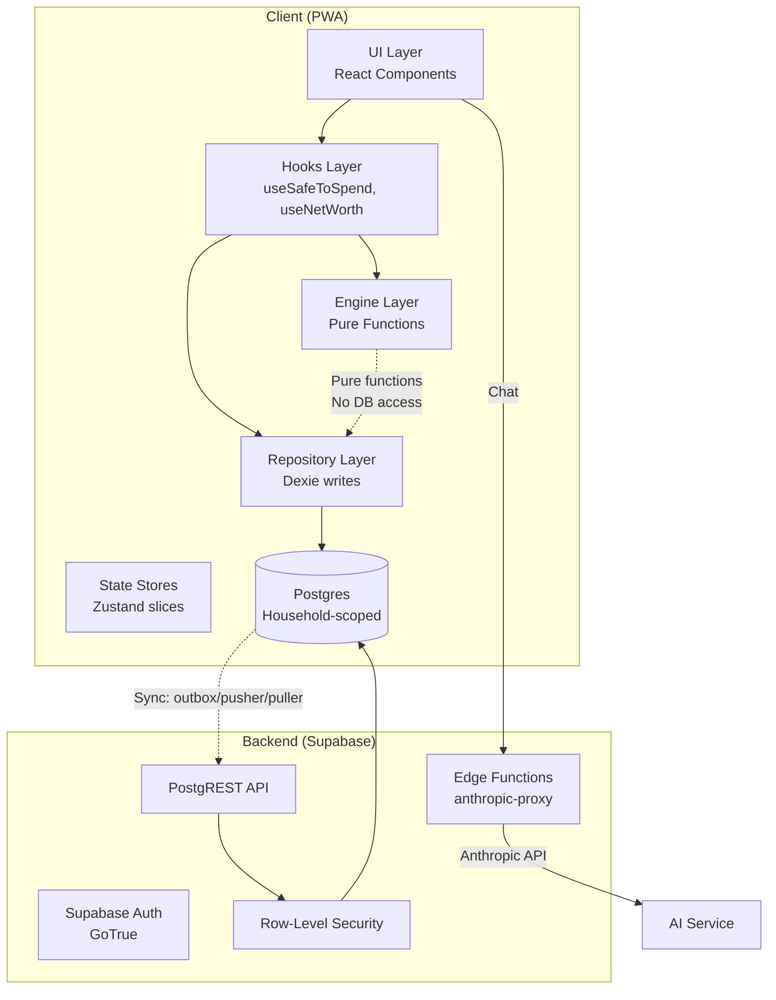

# Architecture — FI Dashboard

**Version:** 2.0  
**Last Updated:** 2026-07-27  
**Status:** Active (supersedes ARCHITECTURE.md v1.0)

---

## System Overview

FI Dashboard is a **local-first PWA** for household financial management. The core job: answer "how much can I safely spend today?" via a savings-first waterfall calculation.

**Architecture pattern:** Client-side pure-function engines → Repository layer (Dexie) → React hooks (liveQuery) → UI components. Supabase provides multi-tenant backend with RLS-based household isolation. Sync via outbox/pusher/puller (LWW, server-stamped).

---

## High-Level Architecture

---

## Data Flow

### Read Path (Typical Screen Load)
1. Component calls hook (e.g., `useSafeToSpend()`)
2. Hook queries Dexie via `useLiveQuery`
3. Dexie returns reactive data from IndexedDB
4. Hook calls engine pure function with data
5. Engine returns computed result
6. Component renders

### Write Path (Transaction Log)
1. User submits via `QuickLogFAB`
2. Repository function writes to Dexie (local)
3. Dexie hooks stamp `updated_at` + assign UUID
4. Outbox enqueues mutation (future: sync to cloud)
5. liveQuery re-fires → UI updates reactively

### Import Path (Chat-Assisted)
1. User pastes statement in chat
2. Edge Function forwards to Anthropic API
3. AI extracts structured transactions via tools
4. Client validates + detects transfers (Web Worker)
5. User confirms batch
6. Atomic write: transactions + snapshot + recurring advances
7. Future: `import_batch` RPC (single transaction, RLS-enforced)

---

## Folder Responsibilities

| Folder | Responsibility | Key Files |
|--------|----------------|-----------|
| `src/ai/` | AI chat tools, context builder, skills | `tools.ts`, `context.ts`, `skills.ts` |
| `src/components/` | Shared UI primitives | `TabBar.tsx`, `PinLockScreen.tsx`, `AmberBanner.tsx`, `BottomSheet.tsx` |
| `src/constants/` | Enum labels, lane definitions | `lanes.ts` |
| `src/db/` | Dexie schema, types, repositories | `db.ts`, `types.ts`, `repositories/*.repo.ts` |
| `src/engine/` | **Pure functions** (no DB access) | `safeToSpend.ts`, `fiProjection.ts`, `savingsRate.ts` |
| `src/features/` | Screen components by domain | `budget/`, `assets/`, `decide/`, `chat/`, `more/` |
| `src/hooks/` | Data hooks (liveQuery wrappers) | `useSafeToSpend.ts`, `useNetWorth.ts`, `useFIProjection.ts` |
| `src/i18n/` | Internationalization | `types.ts`, `en.ts`, `id.ts` |
| `src/import/` | Import pipeline | `parser.ts`, `validator.ts`, `seedTransactions.ts` |
| `src/lib/` | Utilities | `currency.ts`, `dates.ts`, `sync.ts`, `supabaseClient.ts` |
| `src/stores/` | Zustand state slices (UI only) | `appStore.ts`, `authStore.ts`, `pinStore.ts`, `chatStore.ts` |
| `src/workers/` | Web Workers | `transferDetector.ts` |
| `supabase/migrations/` | SQL schema migrations | `*_p0_*.sql`, `*_a_*.sql`, etc. |
| `supabase/functions/` | Edge Functions | `anthropic-proxy/index.ts` |

---

## Major Modules

### 1. Engine Layer (`src/engine/`)

**Pure functions. No side effects. No DB access.**

- `safeToSpend.ts` — Waterfall calculation: income → pay-yourself-first → bills → personal pool → weekly → daily ceiling
- `fiProjection.ts` — Path A (constant blend) vs Path B (RDPU → equity switch) projection to FI target
- `savingsRate.ts` — Active pipe total ÷ take-home net
- `returnRates.ts` — Asset type → real return constant map

**Design principle:** Engines are testable in isolation. Golden test suite covers every branch and boundary (23 tests).

### 2. Repository Layer (`src/db/repositories/`)

**One file per entity group. Atomic Dexie transactions live here.**

- `accounts.repo.ts`, `assets.repo.ts`, `transactions.repo.ts`, etc.
- All writes go through repositories. No component writes to Dexie directly.
- Repositories own transaction boundaries (e.g., `importBatch` commits transactions + snapshot + recurring advances atomically).

### 3. Sync Layer (`src/lib/sync.ts`, `syncMappers.ts`)

**Outbox/pusher/puller pattern. LWW via server-stamped `updated_at`.**

- Outbox: Dexie `_outbox` table of pending mutations
- Pusher: Replay outbox via PostgREST/RPC on reconnect
- Puller: `SELECT * WHERE updated_at > $watermark` on app-open (P0), Realtime subscription (P1+)
- Delete tombstones: soft-delete where supported; `deletions` log for hard deletes

**Status:** Partially implemented. Full cutover is Phase B in PROPOSAL.md.

### 4. AI Chat (`src/ai/`, `src/features/chat/`)

**Anthropic API via Edge Function proxy. Tool-use for DB reads/writes.**

- `tools.ts` — Tool definitions (query_transactions, log_transactions, create_account, etc.)
- `context.ts` — System prompt builder (household data snapshot)
- `skills.ts` — Reusable prompt templates
- `ChatScreen.tsx` — Turn state machine (idle → thinking → awaiting_confirm → committing → idle)

**Safety policy:** AI may explain/classify/surface trade-offs. May NOT recommend buy/sell, issue verdicts, suggest cutting protected categories, or give tax/legal advice. Enforced via prompt + tool surface + human confirm.

### 5. Import Pipeline (`src/import/`, `src/workers/`)

**Human-in-the-loop. Claude-assisted extraction → validation → transfer detection → atomic commit.**

- `parser.ts` — Raw JSON/CSV → ParseResult
- `validator.ts` — Per-row field validation
- `transferDetector.ts` — Web Worker for O(n²) matching (off main thread)
- `seedTransactions.ts` — Demo data seeder (Jan–Jun 2026)

---

## External Integrations

| Service | Purpose | Implementation |
|---------|---------|----------------|
| **Supabase** | Backend (Postgres + Auth + Realtime) | PostgREST API, RLS policies, Edge Functions |
| **Anthropic** | AI chat (Claude API) | Edge Function proxy (`anthropic-proxy`) |
| **Vercel** | Static hosting | Vite build → Vercel deploy |
| **Xendit** | Billing (future, Phase E) | Recurring invoices, webhook Edge Function |

---

## Design Principles

1. **Savings-first waterfall** — Safe-to-spend computed after savings/bills/protected pools
2. **Facts, not advice** — Show consequences, never "don't buy"
3. **Amber informs, never red-alarms** — Exception: over-bucket bars in reports use `--debt` (slate-gray)
4. **Protected categories are untouchable** — No sell UI, no optimization suggestions
5. **Money = integer rupiah (BIGINT)** — Format via `formatRp` in `@lib/currency`
6. **Pure engines** — No business logic in components or SQL policies
7. **Local-first** — Dexie cache, offline capture, sync on reconnect

---

## Extension Points

### Adding a New Screen
1. Create `src/features/<name>/<Name>Screen.tsx`
2. Add tab/route in `App.tsx` SCREENS map
3. Add i18n keys in `src/i18n/types.ts`, `en.ts`, `id.ts`
4. Use existing hooks or create new one in `src/hooks/`

### Adding a New Engine Calculation
1. Create pure function in `src/engine/<name>.ts`
2. Write golden tests in `src/engine/<name>.test.ts`
3. Create hook wrapper in `src/hooks/use<Name>.ts`
4. Consume in components

### Adding a New Synced Table
1. Add Dexie schema in `src/db/db.ts` (version N+1)
2. Add TypeScript type in `src/db/types.ts`
3. Create repository in `src/db/repositories/<name>.repo.ts`
4. Add to `SYNC_TABLES` array in `db.ts`
5. Create Supabase migration in `supabase/migrations/`
6. Add RLS policy (copy from existing domain table)
7. Add sync mapper in `src/lib/syncMappers.ts`

---

## Key Architectural Decisions

See `docs/decisions.md` for full ADR-style documentation.

**TL;DR:**
- Vite+React PWA over Next.js (no SEO benefit, engines are client-side pure functions)
- Dexie over React Query (local data, liveQuery handles reactivity natively)
- Zustand for UI state only (no data in Zustand — avoids dual source of truth)
- Supabase over custom backend (RLS, Auth, Realtime without hand-rolling)
- LWW sync over CRDTs (2-person household, row-level granularity sufficient)
- Integer rupiah everywhere (no floats, no cents)

---

## Threat Model

See `PROPOSAL.md` §2 for full threat model.

**Key risks:**
- Cross-tenant data leak → Mitigated by RLS + isolation tests in CI
- AI proxy abuse → Mitigated by server-side allowlist + per-user budget + usage logging
- Sync conflicts → Mitigated by server-stamped LWW + idempotent retries + delete-beats-update
- Device theft → Mitigated by local PIN + Supabase session refresh + remote sign-out

---

## Performance Budgets

- Dashboard interactive: <500ms on cached data
- Sync push+pull: <2s on reconnect
- 10k-row import: <30s
- FI projection: <100ms (pure function, asserted in tests)

---

## Testing Strategy

- **Engine tests:** Golden-case suite (23 tests) covering every branch and boundary
- **Integration tests:** Dexie + fake-indexeddb for repository flows
- **RLS isolation tests:** SQL tests in CI asserting zero cross-tenant leakage
- **Component tests:** @testing-library/react (minimal, screen-level)
- **No E2E tests yet** — deferred until Phase D (friend beta)

---

## Deployment

- **Frontend:** Vite build → Vercel static hosting (staging + prod projects)
- **Backend:** Supabase managed (staging + prod projects)
- **CI:** GitHub Actions (`.github/workflows/ci.yml`) — lint, typecheck, engine tests, RLS isolation tests

---

## Migration Path (Local → Cloud)

Phase B (per PROPOSAL.md §3):
1. User signs up → creates household → becomes admin
2. Client reads local Dexie, remaps rows: assign `household_id`, `created_by`, convert numeric IDs → UUIDs
3. Push via outbox / one-shot import (bypassing dedupe, fresh tenant)
4. Existing local data lifted into cloud household intact

---

## Vendor Exit Strategy

Schema is plain Postgres (`pg_dump` portable). RLS policies and RPCs are standard SQL. Only Supabase-proprietary surfaces are Auth (email list exportable, passwords re-settable) and two small Edge Functions (portable Deno). Realtime unused until Phase D. Exit cost: days, not months.
